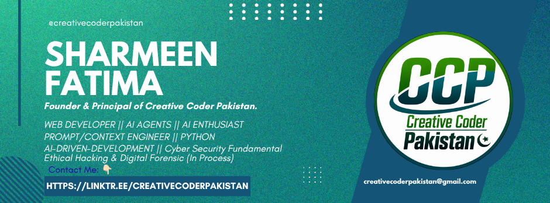

# Hi 👋, I'm Sharmeen Fatima

### AI Engineer | Agentic AI Developer | Full-Stack Developer

**🚀 Founder & CEO — CreativeDev**  
**🎓 Founder & Principal — Creative Coder Pakistan**

🤖 AI Native | Exploring AI-Driven Development

*Aspiring Artificial Intelligence & Robotics Scientist*

---

## 🚀 About Me

I'm **Sharmeen Fatima**, an AI Engineer, Agentic AI Developer, Full-Stack Developer, and Technology Educator from Karachi, Pakistan.

I build intelligent AI agents, autonomous AI employees, AI-powered applications, and modern software solutions that solve real-world problems.

- 🤖 AI Agents, Agentic AI & Intelligent Automation
- 🧠 Prompt Engineering, Context Engineering & RAG
- 💻 Python, Full-Stack & AI-Driven Development
- 🔐 Cybersecurity & Digital Forensics
- 🎓 Founder & Principal — Creative Coder Pakistan
- 🚀 Founder & CEO — [CreativeDev](https://www.creativedev.store/)
- 🌍 Open Source Contributor

---

## 🛠️ Tech Stack & Tools

**Programming & Full-Stack Development**

**Databases & Development Tools**

**AI & Agentic Development**

`OpenAI Agents SDK` • `Claude Code` • `Gemini CLI` • `MCP` • `RAG` • `Qdrant` • `Groq` • `Cohere`

---

## 🧩 Featured Projects

| Project | Description | Link |
|---|---|---|
| 🤖 **Digital FTE** | Autonomous AI Employee with intelligent business automation, Gmail, WhatsApp, Odoo ERP & HITL approvals. | [GitHub](https://github.com/Sharmeen-Fatima/Personal_AI_Employee_Hackathon_0) |
| 📚 **Physical AI & Humanoid Robotics** | Interactive AI textbook with a RAG-powered chatbot. | [Live](https://physical-ai-humanoid-robotics-textb-pied.vercel.app/) |
| ✅ **Evolution of Todo App** | AI-driven full-stack task management application. | [Live](https://frontend-rosy-chi-18.vercel.app/) |
| 🤖 **Fatima AI Assistant** | My personal AI-powered assistant. | [GitHub](https://github.com/Sharmeen-Fatima/Fatima_Ai_Assistant) |
| 🔐 **Dream House CTF** | Cybersecurity learning website with 8 hidden CTF challenges. | [Live](https://dream-house-ctf.netlify.app/) |
| 🚀 **CreativeDev** | AI solutions, software development & intelligent automation. | [Website](https://www.creativedev.store/) |

---

## 🏆 Achievements

- 🥇 **Class Topper — 93 Marks** in Ethical Hacking & Digital Forensics.
- 🤖 AI & Agentic AI — GIAIC.
- 🛡️ Cybersecurity — Bano Qabil, Alkhidmat.
- 🎓 Advanced English Language Diploma.
- 👩‍🏫 Founder & Principal — Creative Coder Pakistan.
- 💼 Founder & CEO — CreativeDev.

---

## 📊 GitHub Statistics

---

## 🌐 Connect With Me

<!-- 

  

#### <h1 align="center">Hi 👋, I'm Sharmeen Fatima</h1>

AI Native 

I'm Exploring Ai-Driven-Development 

Inshallah in Future "Artificial Intelligence & Robotics Scientists"

---
### 🚀 About Me

  

I build intelligent AI systems, autonomous AI agents, and AI-powered solutions that solve real-world problems. I enjoy combining education, artificial intelligence, and modern technology to create practical learning experiences and impactful projects.

- 👩‍💻 AI Engineer
- 🤖 AI Agent Developer
- 🧠 Agentic AI Engineer
- ✍️ Prompt Engineer
- 🧩 Context Engineer
- ⚙️ Builder of Autonomous AI Employees (24/7 AI Workforce)
- 🐍 Python Developer
- 🎓 Educator
- 🏫 Founder & Principal — Creative Coder Pakistan
- 🔓 Cyber Security & Digital Forensics Learner
- 🌍 Open Source Contributor

 ---

### 🔧 Tech Stack & Tools

  

---

<!-- The Repo comment for comment -->
<!-- The Repo comment for comment -->
<!-- The Repo comment for comment -->
<!-- The Repo comment for comment -->

<!-- The Repo comment for comment -->
<!-- The Repo comment for comment -->
<!-- The Repo comment for comment -->
<!-- The Repo comment for comment -->

<!--
---

### 🧩 Featured Projects

| Project | Description | Link |
|--------|-------------|------|
| **Physical-AI-Humanoid-Robotics-Textbook** | This project is a Docusaurus-based textbook focused on Physical AI and Humanoid Robotics. It aims to teach modern robotics concepts including ROS 2, simulation tools, and AI integration through well-organized learning material. | [Physical-AI-Humanoid-Robotics](https://physical-ai-humanoid-robotics-textb-pied.vercel.app/) | 
| **Evolution_Of_Todo_App** |Full-stack web application for multi-user task management built with Next.js and FastAPI. | [Todo_App](https://frontend-rosy-chi-18.vercel.app/) |
| **Digital FTE** | A local-first, autonomous Personal AI Employee system that monitors Gmail, LinkedIn, WhatsApp, manages Odoo ERP, posts on Facebook, Instagram & Twitter, generates CEO weekly audit reports — all with Human-in-the-Loop approval for every critical action. | [Digital FTE](https://github.com/Sharmeen-Fatima/Personal_AI_Employee_Hackathon_0) |
| **Fatima_Ai_Assistant** | OWN Ai Assistant | [Fatima_Ai_Assistant](https://github.com/Sharmeen-Fatima/Fatima_Ai_Assistant.git) | 
| **Dream-House** | For Cyber Security Students challenging website hidden 08 CTF challenge complete website complete responsive website DREAM HOUSE | [Dream_House](https://dream-house-ctf.netlify.app/) | -->

<!-- The Repo comment for comment -->
<!-- The Repo comment for comment -->

<!--
---

## 📱 Connect With Me

| Platform | Link |
|----------|------|
| YouTube |  |
| LinkedIn |  |
| Facebook |  |
| Instagram |  |
| GitHub |  |
| WhatsApp |  |

---

 5. ### 💻 Tech Stack

---
### ***“Learning never stops — stay curious, stay creative!”***  

