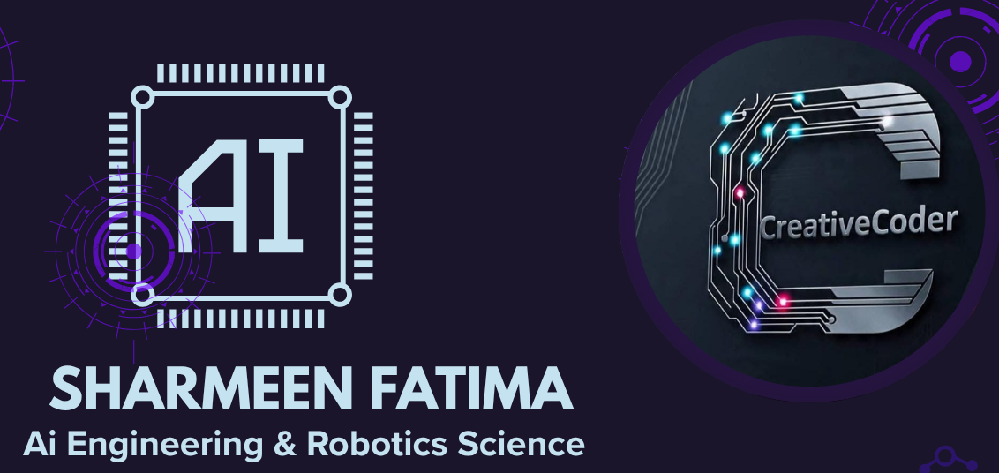

  

<h1 align="center">Hi 👋, I'm Sharmeen Fatima</h1>

Web Developer exploring AI Agentic SDK, living in Karachi, Pakistan

Inshallah in Future "Artificial Intelligence & Robotics Scientists"

---

### 🚀 About Me
- 🌱 Currently diving deeper into **Python**, **AI Agent**, and **open-source Web Projects.**
- 💻 Experienced with **HTML**, **CSS**, **JavaScript**, and building real-world apps.
- 🤝 Always open to collaborate on **AI + Web integration**, **frontend innovation**, or **portfolio projects.**
- 📫 Feel free to reach out: **✉️ (Sharmeenfatima67@gmail.com).**
- ✒ For more information about ***Agentic Ai*** and updates Join **[Whatsapp Channel](https://whatsapp.com/channel/0029VbAqY7w002TIRJYUHG3X).**
- 🎯 For more information about ***N8N in Agentic Ai*** and updates Join **[Whatsapp Channel](https://whatsapp.com/channel/0029Vb6ZMNn9WtC60YWzyh15).**

---

### 🔧 Tech Stack & Tools

  

---

### 🧩 Featured Projects

| Project | Description | Link |
|--------|-------------|------|
| **Dream-House** | Complete responsive website built with HTML & CSS | [Dream_House](https://github.com/Sharmeen-Fatima/Dream-House) |
| **Internnship-Internncraft** | Internship HTML/CSS project | [Internnship_Internncraft](https://github.com/Sharmeen-Fatima/Internnship-Internncraft) |
| **Fatima_Ai_Assistant** | OWN Ai Assistant | [Fatima_Ai_Assistant](https://github.com/Sharmeen-Fatima/Fatima_Ai_Assistant.git) |

---

### 📱 Connect With Me

  
  

---

### 📊 GitHub Stats

---
### 📊 Top Languages

---

---
## 📈 GitHub Contribution Graph

---
### ***“Learning never stops — stay curious, stay creative!”***
